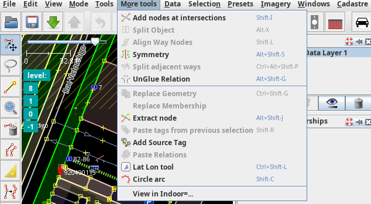

# indoor= JOSM plugin

This plugin lets you visualize your JOSM indoor data into [indoor=][]. It adds a menu entry in the "More tools" entry and. On click it open the the current layer on [indoor=][] as a preview.

## Install

### Via JOSM

The indoor= JOSM plugin is available via the *Preferences* -> *Plugins* panel.
[Follow the instructions](https://josm.openstreetmap.de/wiki/Help/Preferences/Plugins) and search for indoorequal.

### Manually

Download the jar from the latest release: https://github.com/indoorequal/indoorequal-josm-plugin/releases/download/latest/indoorequal.jar and put it in the <user data directory>/plugins of your JOSM install: https://josm.openstreetmap.de/wiki/Help/Preferences#JOSMpreferencedatacachedirectories and enable the plugin via the *Preferences* -> *Plugins* panel.

## License

GNU GPL 3

[indoor=]: https://indoorequal.org/
